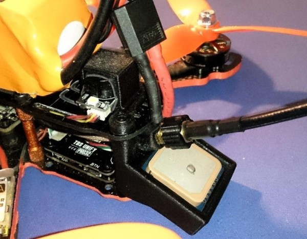
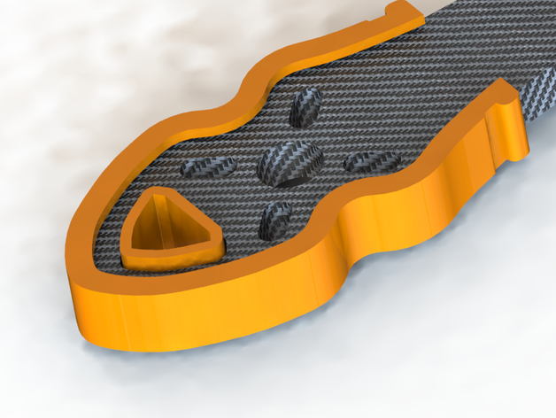
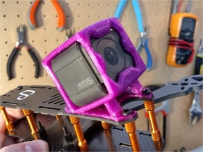

# Archivos STL

Modelos para impresión 3D de piezas del frame [Helium][https://dedrones.es/helium] de deDrones.

* [Soporte GPS BN-220](#soporte-gps-bn-220)
* [Protector de las patas del frame](#protector-para-las-patas)
* [Soporte de antenas](#soporte-de-antenas)
* [Soporte de GoPro Session](#soporte-para-gopro-session)

Si no tienes impresora 3D, los chicos de deDrones tienen algunas de las piezas ya impresas [en la tienda](https://dedrones.es/tienda), así como un servicio de impresion 3D para imprimir [tus propios diseños](https://dedrones.es/impresion-3d).

## Soporte GPS BN-220

Soporte para GPS Beitian bn-220 y antena de video.

**STL:** [gps4.stl](gps4.stl)

**Autor:** Manuél Avilés Morant

## Protector para las patas

**STL:** [patas.stl](patas.stl)

**Autor:** deDrones

**Thingiverse:** https://www.thingiverse.com/thing:3888683

## Soporte de antenas

**STL:** [soporte-antenas.stl](soporte-antenas.stl)

**Autor:** Jose Miguel Lopez

**Thingiverse:** https://www.thingiverse.com/thing:4034535

## Soporte para GoPro Session

**STL:** [soporte-session.stl](soporte-session.stl)

**Autor:** 3D Para Todo

**Thingiverse:** https://www.thingiverse.com/thing:3896479
