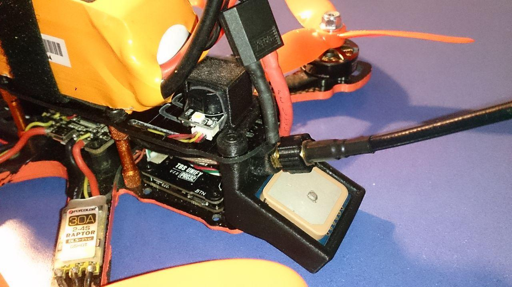
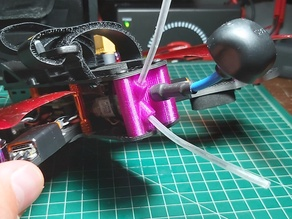

# Archivos STL

Modelos para impresión 3D de piezas del frame [Helium][https://dedrones.es/helium] de deDrones.

* [Soporte GPS BN-220](#soporte-gps-bn-220)
* [Protector de las patas del frame](#protector-para-las-patas)

## Soporte GPS BN-220

[gps4.stl](gps4.stl)

Soporte para GPS Beitian bn-220 y antena de video.

**Autor:** Manuél Avilés Morant

## Protector para las patas

[patas.stl](patas.stl)

**Autor:** deDrones

**Thingiverse:** https://www.thingiverse.com/thing:3888683

## Soporte de antenas

[soporte-antenas.stl](soporte-antenas.stl)

**Autor:** Jose Miguel Lopez

**Thingiverse:** https://www.thingiverse.com/thing:4034535
